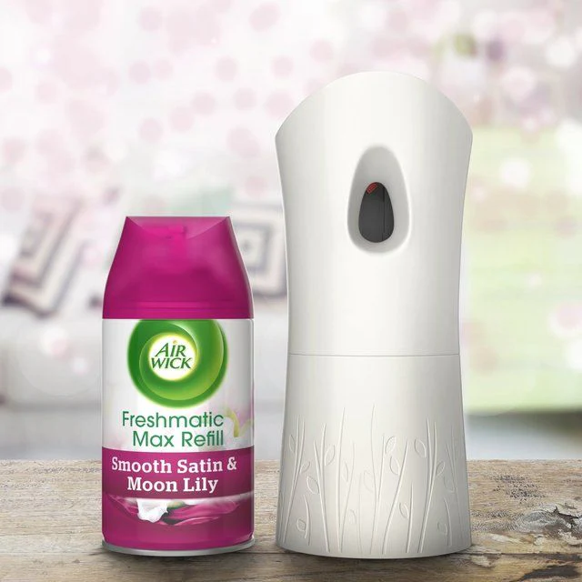
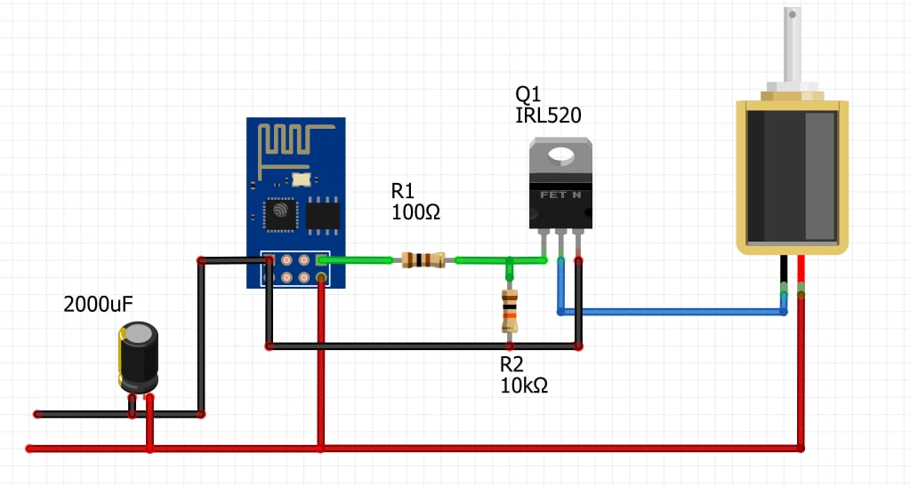

## Air freshener | AirWick or Glade based

Automatic air freshener, uses AirWick or Glade as a donor, battery operated, integrated into Home Assistant via MQTT.

## Scheme

## Config

[Air freshener Package](https://github.com/andrewjswan/esphome-config/blob/documentation/packages/air_freesh.yaml)
