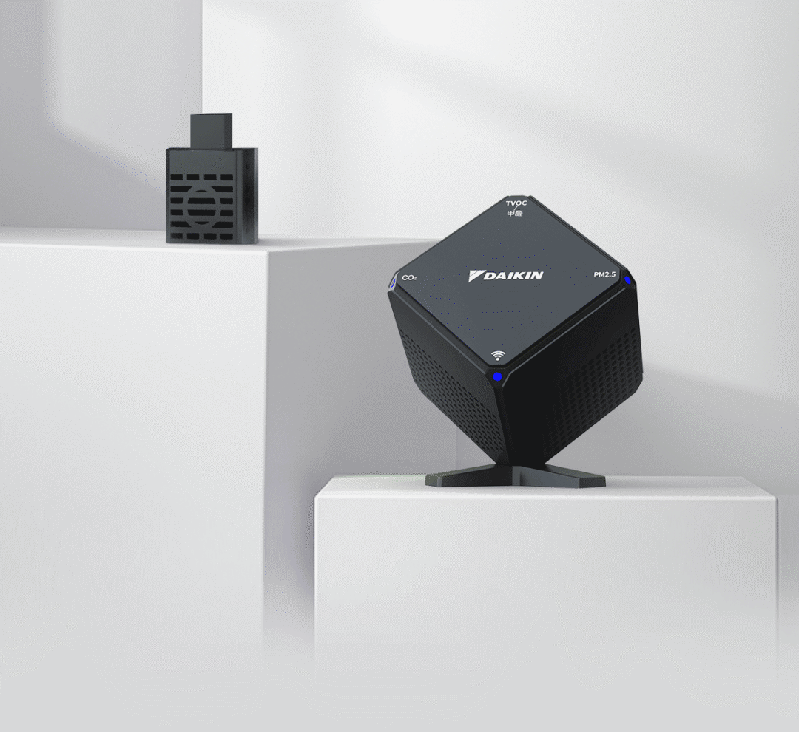

## Daikin Air Sensor | BRY88AB151K

The model of this Daikin air sensor is BRY88AB151K (or BRY88AA151K), which is manufactured by Daikin Air Conditioning (Shanghai) Co., Ltd. The packaging is a white carton that is similar to a cube. After opening the package, you can see the sensor, USB power adapter, product certification, and instruction manual. The power cable is connected with the sensor. The power plug is a standard USB plug, the input voltage range of the power adapter is AC100-240V – 50/60Hz, which seems to be the universal voltage, and the output is the standard USB DC5V – 1A. The sensor is also in the shape of a regular cube, the whole body is black, but the base is fixed on one of the corners. When placed on the desktop, it seems that a corner of the whole cube is embedded in the desktop, which is quite unique. There are four LED indicator lights on the four corners of the front panel,  judging from the text next to the indicator lights, they should be used to indicate the working status of each sensor respectively. The size of the sensor is 72mm x 72mm x 72mm.

More information by [link](https://hasstech.cn/?p=1), config based on [Daikin Air Sensor Repository](https://github.com/louliangsheng/daikin-air-sensor)

## Components used

- [CUBIC CM1106 Single Beam NDIR CO2 Sensor Module](https://esphome.io/components/sensor/cm1106/)
- [CUBIC PM2005/PM2105 Laser Particle Sensor Module](https://esphome.io/components/sensor/pm2005/)
- [TEXAS HDC1080 Temperature / Humidity Sensor](https://esphome.io/components/sensor/hdc1080/)
- [SENSIRION SGP30 TVOC / eCO2 sensor](https://esphome.io/components/sensor/sgp30/)

## Config

[Daikin Air Sensor Package](https://github.com/andrewjswan/esphome-config/blob/documentation/packages/daikin_air_sensor.yaml)
