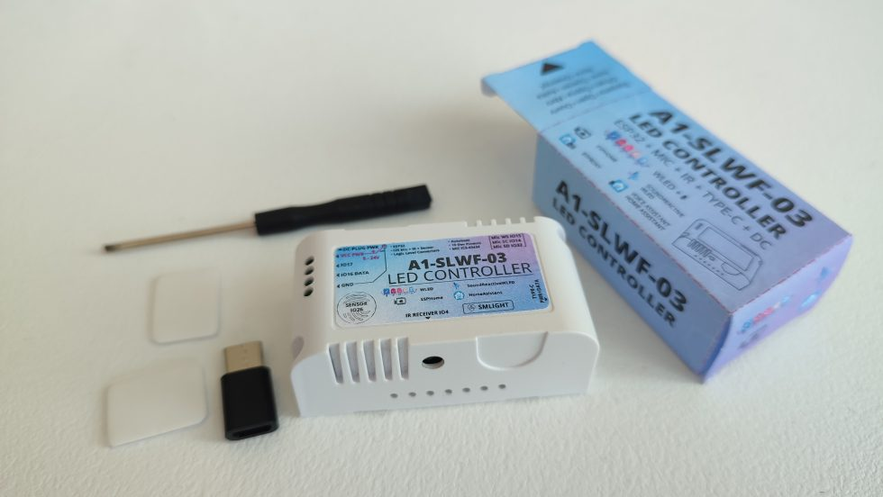

## Music Leds | Sound Reactive and Hyperion

## Hardware

[A1-SLWF-03](https://smlight.tech/product/slwf-03/) WLED Sound Reactive LED Controller is a tiny adressable led strip controlled based on ESP32.

## Components used

- [Music Leds / Sound Reactive](https://andrewjswan.github.io/esphome-components/music-leds/)

## Config

- [Music Leds Base Package](https://github.com/andrewjswan/esphome-config/blob/main/packages/neopixel_light.yaml)
- [Music Leds Common Effects Package](https://github.com/andrewjswan/esphome-config/blob/main/packages/neopixel_light_common.yaml)
- [Music Leds Fastled Effects Package](https://github.com/andrewjswan/esphome-config/blob/main/packages/neopixel_light_fastled.yaml)
- [Music Leds Sound Reactive Effects Package](https://github.com/andrewjswan/esphome-config/blob/main/packages/neopixel_light_music_leds.yaml)
- [Music Leds Hyperion Package](https://github.com/andrewjswan/esphome-config/blob/main/packages/neopixel_light_ddp.yaml)
